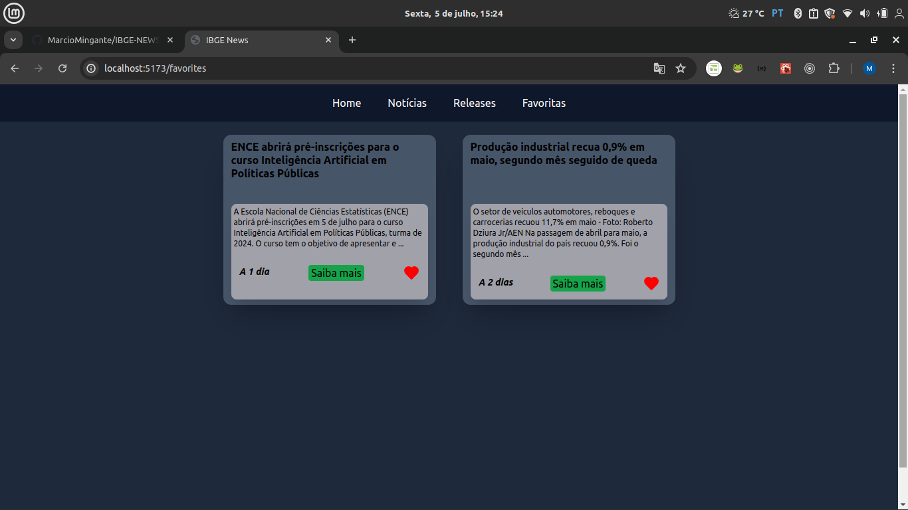

<h1 align="center" style="font-weight: bold;">IBGE News</h1>

<p align="center">
 <a href="#tech">Tecnologias</a> • 
 <a href="#started">Começando</a> • 
 <a href="#contribute">Contribua</a>
</p>

<p align="center">
    <b>Essa aplicação tem a função de consumir a API de notícias do IBGE e apresentar organizadamente para o usuário as últimas notícias e releases disponibilizados pela mesma.</b>
</p>

<h2 id="layout">Imagens</h2>

<p align="center">
    
    
</p>

<h2 id="technologies">Tecnologias</h2>

- react
- react-router-dom
- tailwind
- lucide-react

<h2 id="started">Começando</h2>

Para rodar o projeto localmente

 1 - Clone o repositorio usando o comando `git clone url-do-projeto` (ou chave SSH / ou GitHub CLI)  
 2 - Entre no diretorio que foi criado ao clonar o repositorio e rode o comando `npm install` no terminal  
 3 - Abra o projeto no vsCode usando o comando `code .`  
 4 - Dentro do vsCode abra um novo terminal e rode o comando `npm run dev`

<h3>Clonando</h3>

```bash
git clone url-do-projeto
```

<h3>Começando</h3>

```bash
cd project-name
npm install
code .
npm run dev
```

<h2 id="contribute">Contribua</h2>

1. `git clone chave-ssh ou url-do-projeto`
2. `git checkout -b feature/NAME`
3. Siga padroes de commit
4. Abra um pull request com o problema resolvido ou função criada, e caso existam, adicione prints de modificações visuais e espere o review!

<h3>Documentações que podem ajudar</h3>

[💾 Commit pattern](https://gist.github.com/joshbuchea/6f47e86d2510bce28f8e7f42ae84c716)
